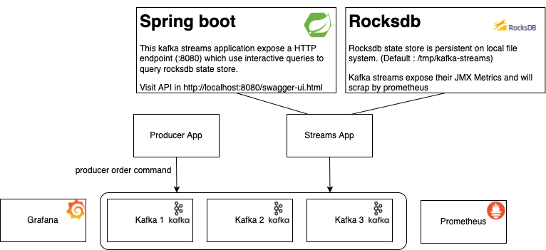
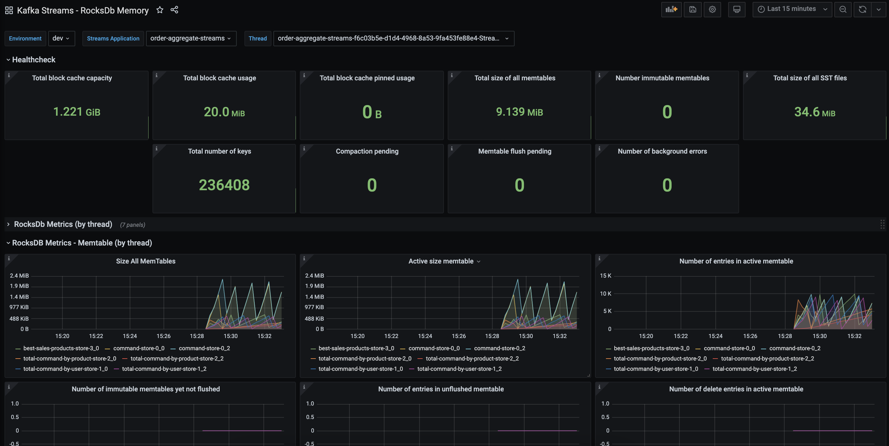

# monitoring-rocksdb-kstream

**How monitor rocksdb memory inside a kafka streams application ?**

## Prerequisites

You need to have docker and docker-compose installed.

## Getting started

``` bash
git clone https://github.com/LGouellec/monitoring-rocksdb-kstream.git
cd monitoring-rocksdb-kstream
```

## Build local images

This repository contains some local docker images including :
- a simple producer which mock `command` order in avro format
- a kafka streams application (statefull) which aggregate some r
  - get the total price command by day and user
  - get the total price command by day and product
  - get the 3 best sales product by day
  - store all commands into a rocksdb state store

To build all images you just need to run :

```bash
docker-compose build
```

## Start the environment

To start the environment simply run the following command

```bash
docker-compose up -d
```

Open a brower and visit http://localhost:3000 (grafana). 
`Login/password is admin/admin`

## Destroy the environment

To destroy the environment simply run the following command to destroy containers and associated volumes :

```bash
docker-compose down -v
```

## Setup



List of docker containers :
- `kafka-1`, `kafka-2`, `kafka-3` : 3 brokers kafka
- `zookeeper-1`, `zookeeper-2`, `zookeper-3` : 3 zookeeper nodes
- `producer` : simple producer
- `streams` : kafka streams statefull application and expose :8080 to request them (see swagger's contract on http://localhost:8080/swagger-ui.html)
- `prometheus` : monitoring system with a dimensional data model
- `grafana` :  open source analytics and interactive visualization web application
- `schema-registry` : distributed storage layer for schemas which uses Kafka
- `akhq` : Kafka GUI for Apache Kafka to manage topics, topics data, consumers group ...

## Rocksdb dashboard



You have some differents panels in this dashboard :
- Healthcheck : Aggregation on different key metrics across all stream threads of one kafka streams app
- Rocksdb Metrics (by thread) - Key metrics by thread
- Rocksdb Metrics - Memtable (by thread) - Memtable metrics by thread
- Rocksdb Metrics - Blockcache (by thread) - Block cache metrics by thread
- Rocksdb Metrics - SST files (by thread) - SST metrics by thread
- Rocksdb Statistics (by thread) - Some low level metrics exposed by rocksdb (set `metrics.recording.level` to `DEBUG`)

## The more important monitoring points about rocksdb memory

**size-all-mem-tables** :
The approximate size of active, unflushed immutable, and pinned immutable memtables in bytes.

**block-cache-usage** :
The memory size of the entries residing in block cache in bytes.

**block-cache-pinned-usage** :
The memory size for the entries being pinned in the block cache in bytes.

**estimate-table-readers-mem** :
The estimated memory in bytes used for reading Sorted Sequence Tables (SSTs), excluding memory used in block cache.

**total-sst-files-size** :
The total size in bytes of all Sorted Sequence Table (SST) files.

**memtable-bytes-flushed-rate** :
The average number of bytes flushed per second from the memtable to disk.

**bytes-read-compaction-rate** :
The average number of bytes read per second during compaction.